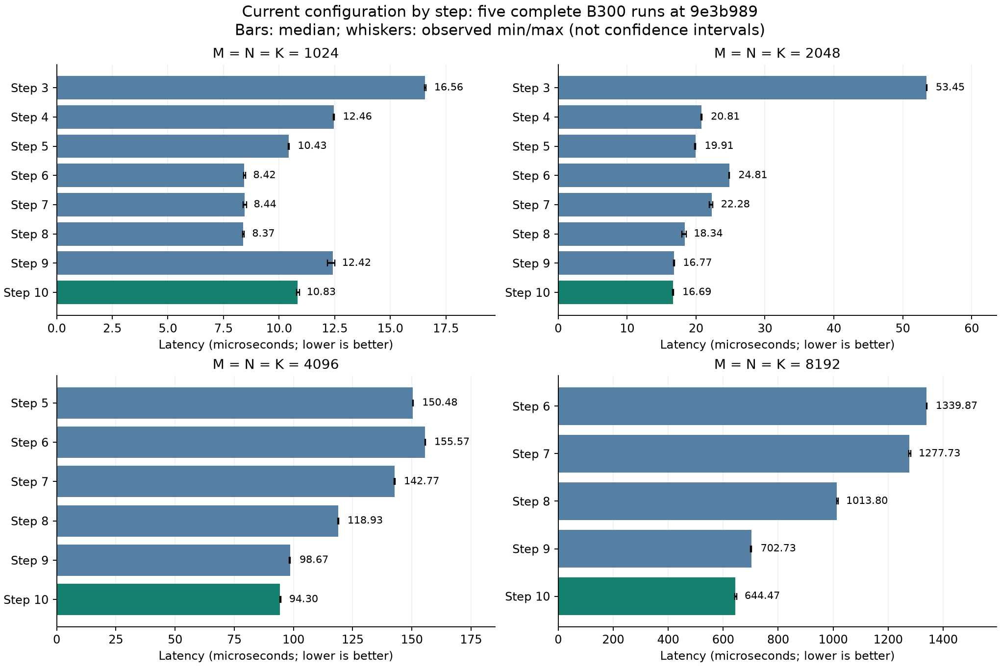
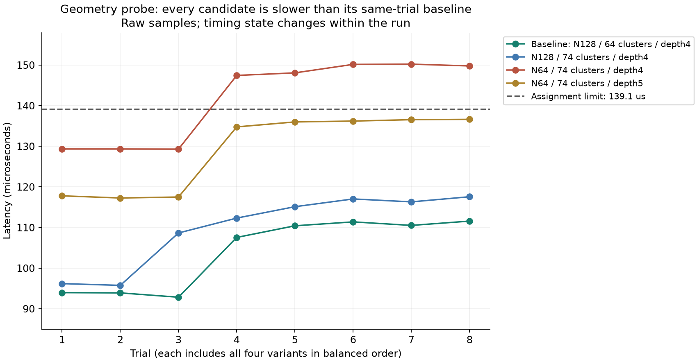

# 从零读懂 Blackwell GEMM：十步实现、优化实验与数据解释

本文面向第一次接触 GPU kernel 的同学。目标是读完后能回答：矩阵乘法的数据怎样经过 GPU，十个步骤分别解决了什么问题，哪些优化确实测到了收益，以及为什么有些“看起来更先进”的方案反而更慢。

**已有五轮 B300 验收通过记录，但后续运行的性能稳定性仍未解决。** `9e3b989` 的五轮全量测试各 **62 passed**，共 310 次用例执行通过；五份正式 benchmark 各覆盖 37 个评分形状，合计 **185/185 PASS**。本文核对的主仓版本为 `32d4fa8`，其正式内核、计时和评分逻辑、GPU tests 与该验收版本一致。

2026-09-15 新复测再次出现 **61 passed / 1 failed**：Step 10／4096 为 **0.139973 ms**，比原门槛高约 **0.628%**；随后一次同项仍超线。以下五轮通过的数据继续保留，不能把它们当作所有后续条件下都稳定的保证。新失败与缺失元数据见 [验证记录](B300_VALIDATION.md)，聚焦诊断命令见 [RUNNING.md](RUNNING.md)。

随后归档的 `step10_diagnose.MBawzh` 已把问题缩小到单项：三次 pytest 全失败，八轮正式 benchmark 只有 2/8 样本达标。生成的 CUDA/cubin/编译选项与历史快记录一致；本轮卡为 778768b4…，有设备身份记录的历史快卡为 dadf9f3b…。这表明下一步值得控制设备与作业条件比较，尚不能证明卡故障或把所有失败归于限频。前三次 pytest 的限频计数没有新增，benchmark 窗口有功耗限制新增；详见验证记录开头。

用户目前只能用一张 GPU，后续 `step10_runtime._v5qw220` 已做同卡对照：把 30 次计算打包成 CUDA Graph 后，配对耗时下降约 2.2%–2.5%，但普通提交在八秒负载前后都约 0.140 ms，仍只有 2/16 样本达标。负载期间 80 次采样的 SM 时钟全为 1095 MHz，大部分利用率为 99%–100%，功耗限制累计时间增加 8.161490 秒、热限制未增加。这些状态可供设备策略核对，但用户要求直接推进软件优化，目前准备了保留四级输入的 64/128 列写回与 32 列 SMEM 双缓冲候选，尚待 GPU 测量。不能直接认定人为锁频，也不能用 Graph 数据替代原评分。详细原始记录和解释见 [验证记录](B300_VALIDATION.md)。

用户提供的增量 review 与原始记录一致：上一轮“验收未完成”的 P1 应关闭。Step 9 两份复核目录已经归档；几何候选已经测过、没有采用。本文及运行说明更正了这些状态遗漏。

建议第一次阅读按以下顺序进行；需要复现实验时再查 [RUNNING.md](RUNNING.md)。完整历史保留在 [B300_VALIDATION.md](B300_VALIDATION.md)，本文负责把历史整理成可理解的技术路线。

- [先认识计算和 GPU](#一先认识我们究竟在算什么)：不需要 CUDA 基础。
- [读懂性能数据](#二先学会读数据再讨论优化)：区别“达标”“更快”“归因”。
- [十步实现](#四step-1先把一个小矩阵块算正确)：从单 tile 走到双 consumer。
- [失败实验与诊断](#十四那些没有采用的优化教会了我们什么)：为什么不继续堆参数。
- [验收与复现](#十六验收究竟覆盖了什么)：代码、数据和结论如何对应。

## 一、先认识我们究竟在算什么

### 1. 一次 GEMM 是很多个点积

全部内核计算 **`D = A @ B.T`**。A 有 M 行、K 列；B 有 N 行、K 列；D 有 M 行、N 列。输出位置 `(m,n)` 的计算是：

```text
D[m,n] = A[m,0]×B[n,0] + A[m,1]×B[n,1] + … + A[m,K-1]×B[n,K-1]
```

例如 A 的一行为 `[1,2,3]`，B 的一行为 `[4,5,6]`，对应输出就是 `1×4+2×5+3×6=32`。这里 B 已按 `(N,K)` 保存，每一行就是一个点积需要的向量；数学上的 `.T` 不表示内核必须先在显存里生成一份转置副本。

三个尺寸扮演不同角色：M、N 决定有多少个输出，K 决定每个输出要累加多长。**输出面积相同，K 不同，工作量仍可能差很多。** 这也是不能只用四个方阵就断言所有长方形都达到最优的原因。

输入和最终输出用 FP16，每个数占 2 字节；累加器用 FP32，每个数占 4 字节。可以理解为用较小格式运输数据，用较高精度保存长串加法的中间结果，最后再转成 FP16。浮点运算存在舍入，验证使用误差容限，不要求与另一种计算顺序逐位一致。

一次乘法加一次加法按 2 次浮点运算计，因此通常用 `2×M×N×K` 估计工作量。1 TFLOP/s 表示每秒约一万亿次浮点运算。4096 方阵约有 1374 亿次浮点运算。当前 Step 10 的典型耗时约 **94.30 微秒**，按这一口径约为 **1457.54 TFLOP/s**。这是该次 GEMM 的有效吞吐率，不是 GPU 对任意程序都能达到的速度。

### 2. GPU 的“人、车间和任务”

可以把 GPU 想成一座有许多车间的工厂，但下面这些名称对应真实、不同的硬件或软件概念。

| 术语 | 初学者可以怎样理解 | 本实验里怎样使用 |
|---|---|---|
| kernel | 交给 GPU 执行的一段程序 | `hgemm_v1`–`hgemm_v10` 生成不同的矩阵乘法内核 |
| thread，线程 | 执行程序的一条工作线 | 负责取数、地址计算、发出命令、转换结果等 |
| warp | 32 个线程组成的执行组 | 选举其中一个线程发射 TMA/MMA 命令，或协作搬运 |
| warpgroup，WG | 4 个相邻 warp，共 128 线程 | 本实验的 TMEM 读回以此组织；后期按 WG 分工 |
| CTA / thread block | 一组协作线程，共享一块 SMEM | 前几步每 CTA 负责一个输出块，后期会连续处理多个 |
| SM | GPU 上执行 CTA 的硬件单元 | 本次 B300 有 148 个 SM |
| cluster | 多个 CTA 的协作组 | Step 9/10 每组两个 CTA，使用跨 CTA 的 MMA 与同步 |
| tile | 从大矩阵切下来的一块工作 | 常见输出块为 128×128、256×256、512×128 |
| Tensor Core / MMA | 专门做矩阵乘加的计算单元 / 命令 | 读取准备好的输入，把累加结果写到 TMEM |

**148 个 CTA 不等于“软件保证每个 SM 恰好一个 CTA”。** 实际驻留和调度受线程数、寄存器、SMEM、TMEM、cluster 要求等共同约束。本文用 SM 数推导的是启动配置和任务分配，不冒充实测占用率。

发射 MMA 的线程也不是亲自做完所有乘加。它像按下机器的启动按钮，后面的矩阵运算由专门硬件执行。因此“只有一个线程发射”与“只利用了一个普通运算线程”完全不是一回事。

### 3. 数据在 GPU 里怎样走

| 存储位置 | 用途 | 为什么不能把所有数据都放进去 |
|---|---|---|
| GMEM / HBM，显存 | 保存完整 A、B、D | 容量大，但访问需要时间，也有带宽上限 |
| L2 cache，二级缓存 | 自动缓存显存中的近期数据 | 是否命中取决于访问顺序、工作集和其他活动 |
| SMEM，共享内存 | CTA 就近存放当前几块输入或待写回结果 | 容量有限；多留一个缓冲槽就多占资源 |
| TMEM，Tensor Memory | Blackwell MMA 的累加器等专用存储 | 需要显式分配、访问和同步；不能当普通大数组随便用 |
| register，寄存器 | 线程手头的地址、状态、读回数据 | 每 SM 总量有限；单线程用多了可能影响驻留或产生额外存储 |


这张图是 Step 4 以后主要的数据通路。Step 1–3 的最后一步直接从寄存器写显存。TMA 是硬件提供的异步块搬运方式，可以把“许多线程逐个计算地址并搬数据”变成“少量线程提交一项搬运任务”。提交完成不代表数据已经到达，必须等对应的完成信号。

地址布局里的 **swizzle** 是一种重新排列共享内存地址的方式，目的是适配硬件访问、减少不利的存储访问冲突；它不改变矩阵数学上的行列含义。初读时先理解数据属于哪一块，再研究布局表达式即可。

### 4. 优化绕不开的四种成本

一个 kernel 的时间可能消耗在启动和初始化、搬运数据、执行乘加、写回和同步上。这些事情能够部分重叠，**不能简单把 profiler 给出的不同角色百分比相加**。

没有重叠时，取一块数据耗时 L，计算耗时 C，连续处理 q 块大约需要 `q×(L+C)`。理想流水线在预热后可以接近：

```text
L + C + (q-1)×max(L,C)
```

这只是帮助理解的模型。真实硬件还要考虑有限缓冲、多个角色争用资源、写回和收尾。它说明了两个关键点：重叠可以隐藏一部分等待；但如果只处理一块，流水线几乎没有后续工作可重叠，反而可能付出更多初始化成本。

## 二、先学会读数据，再讨论优化

### 1. 本文使用两种比较，回答不同问题

**当前各步骤的表现**来自同一验收版本的五份全步骤 CSV。每个形状取五次耗时的中位数，表明最终保留下来的各步配置表现如何。相邻 Step 可能同时改变多个机制，不能把差值全归给某一个参数。

**单个优化的历史对照**来自同一 probe 中的 baseline、候选和原始逐轮样本。它回答“在当时那个版本与运行条件下，改这一项或这一组配置有没有帮助”。历史 baseline 不是今天的最新正式配置，也不能跨目录拿一个最快值和另一个最慢值相除。

后文把这两类数据分别写成“当前跨步观察”和“历史同轮对照”。旧 probe 的测量顺序曾有缺陷，凡旧记录中的千分之几收益，都只能作为当时的支持性证据，不能包装成精确且普遍成立的收益。

### 2. 加速、降时和余量是三个数

设对照耗时为 A，候选耗时为 B：

| 指标 | 公式 | A=100 μs、B=80 μs 的例子 |
|---|---|---|
| 加速倍数 | `A/B` | 1.25× |
| 相同工作量的吞吐率提升 | `(A/B-1)×100%` | 25% |
| 耗时下降 | `(1-B/A)×100%` | 20% |
| 相对门槛的余量 | `(limit-B)/limit×100%` | 门槛若为 130 μs，则为 38.46% |

本文历史实验的“配对加速”是先计算每轮 `A_i/B_i`，再取中位数；“耗时下降”也从逐对比例取中位数。**它们不一定等于表中两列耗时中位数直接相除。** 这可以减少不同轮次共同快慢变化的影响，但无法完全消除同一轮内的状态漂移。

`1 ms = 1000 μs`。例如 0.139042→0.138689 ms，只相差约 0.353 μs 的两个总体中位数；逐对节省的中位数又可能不同。不要看到小数位很多，就误以为改善幅度很大。

### 3. 计时器究竟测了什么

正式 benchmark 使用 CUDA events，预热 10 次，再对连续 30 次执行取平均。一个 trial 得到的是一批执行的平均耗时；`--trials 7` 才会得到七个这样的样本。编译在计时之外，终端里 pytest 的总秒数也不等于 GPU GEMM 的耗时。

当前验收是五个独立 benchmark 进程，每个 `trials=1`。因此有五个批量平均值可汇总，**不是每个形状测了 35 个 trials，也不能看到 PASS 就自动推断每一次单独 launch 都低于门槛。**

评分门槛固定为 `reference_ms×1.30`。Step 10／4096 的参考值为 0.107 ms，门槛就是 **0.139100 ms**。达到门槛表示完成作业的性能要求；要证明候选值得采用，还必须比同轮正式 baseline 更快。

## 三、先看全貌：十个步骤最终达到了什么

下表是五次验收的中位数，单位 ms。`—` 表示原评分表没有在该 Step 测这个形状，不表示该形状失败，也不把空白补成推测值。Step 1/2 的固定小输出另列在各节。

| Step | 1024³ | 2048³ | 4096³ | 8192³ |
|---|---:|---:|---:|---:|
| 3：二维 tile | 0.016562 | 0.053451 | — | — |
| 4：TMA | 0.012457 | 0.020810 | — | — |
| 5：输入双缓冲 | 0.010426 | 0.019911 | 0.150484 | — |
| 6：persistent | 0.008419 | 0.024813 | 0.155573 | 1.339871 |
| 7：角色分工 | 0.008445 | 0.022275 | 0.142769 | 1.277727 |
| 8：四级输入流水线 | 0.008373 | 0.018337 | 0.118931 | 1.013805 |
| 9：双 CTA cluster | 0.012417 | 0.016772 | 0.098673 | 0.702735 |
| 10：双 consumer 共享 B | 0.010830 | 0.016688 | 0.094295 | 0.644471 |



图中横轴为微秒，条越短越好；细线是五次观测的最小值和最大值，**不是置信区间**。四个面板横轴范围不同，只在同一面板内直接比较条长。[PDF 版](docs/figures/current_steps.pdf)可用于报告；[完整 37 形状数据](docs/optimization_data/current_steps.csv)保留未舍入值。

同一形状上的路线收益很直观：2048 从 Step 3 到 Step 10，耗时下降 **68.78%（3.203×）**；4096 从 Step 5 到 Step 10，下降 **37.34%（1.596×）**；8192 从 Step 6 到 Step 10，下降 **51.90%（2.079×）**。这些是完整配置的观察差异，不是把各个历史小优化的百分比相加得到的。

下面是阅读代码时可对照的配置。这里“输出 tile”指一次调度任务，不是整个 kernel 的输出。

| Step | 一次输出任务 | 每段 K | 输入 SMEM 槽数 | CTA 线程数 | 新增的主要机制 |
|---|---|---|---:|---:|---|
| 1 | 128×128 | 固定 64 | 1 | 128 | 跑通单块计算和读回 |
| 2 | 128×128 | 64 | 1 | 128 | K 循环累加 |
| 3 | 128×128 | 64 | 1 | 128 | 多 CTA 覆盖输出 |
| 4 | 128×128 | 128，不能整除时 64 | 1 | 128 | TMA 输入和输出 |
| 5 | 128×128 | 64 | 2 | 128 | 输入预取与环形复用 |
| 6 | 128×128 | 128，不能整除时 64 | 2 | 128 | 常驻 CTA、L2 分组 |
| 7 | 128×128 | 128，不能整除时 64 | 2 | 256 | 搬运、MMA、写回独立推进 |
| 8 | 128×128 | 64 | 4 | 256 | 加深输入流水线、缓存基址 |
| 9 | cluster 256×256 | 64 | 4 | 每 CTA 256 | 两 CTA 协作，一个 MMA consumer |
| 10 | cluster 512×128 / 512×256 | 64 | 4 | 每 CTA 384 | 两 consumer 共享 B，输出单/双槽 |

## 四、Step 1：先把一个小矩阵块算正确

代码入口：[gemm_kernels.py](gemm_kernels.py) 的 `hgemm_v1`。

第一步只处理 `M=N=128、K=64`，只有一个 CTA、128 个线程。整个流程是：线程协作从显存加载 A/B 到 SMEM；选举一个线程发射 MMA；等累加完成；整个 WG 从 TMEM 读出 FP32 结果，转换为 FP16，再写入 D。

即使题目很小，也已经包含最终高性能内核的基本组件：输入布局、MMA、累加器、结果格式转换和同步。K64 在底层拆成 K16 的 MMA 指令来完成；Python/TIR 里一个矩阵操作不必只对应一条机器指令。

**这里首先验证的是完整数据通路，尚没有“上一版”的性能提升可报。** 当前耗时中位数 **0.005430 ms，即 5.430 μs，约 0.39 TFLOP/s**。这不说明 Tensor Core 算得慢：工作量只有约 210 万次浮点运算，而且只有一个 CTA，绝大多数 GPU 资源没有这个任务可做，启动与同步的固定成本占比很大。

本步保留 512 列 TMEM 分配，实际输出使用其中 128 列，作为简单教学基线。后续会看到分配大小和分配许可的区别；不需要一开始就把所有资源技巧堆进这个最小例子。

读代码时要找到三个安全边界：SMEM 写入后，MMA 才能读；MMA 完成后，线程才能读 TMEM；全部 TMEM 读取完成后，才能释放它。跳过任何一个，都可能让“偶尔算对”冒充正确实现。

## 五、Step 2：沿 K 分段累加，不搬运中间结果

代码入口：`hgemm_v2`。

现在仍只输出一个 128×128 tile，但 K 可以很长。例如 K=4096 时，把每个点积分成 64 段，每段处理 64 个元素。数学上就是把一条长求和拆成多个短求和。

```text
第一次：acc = A0 × B0.T
第二次：acc = acc + A1 × B1.T
……
最后：D = FP16(acc)
```

第一次 MMA 必须初始化累加器，之后才是累加；FP32 中间结果一直留在 TMEM，只在所有 K 段结束后写回一次。这避免把每一段的中间结果都送回显存，再读回来继续加。

| 固定 M=N=128 | K 段数 | 当前五次中位数 ms |
|---|---:|---:|
| K=64 | 1 | 0.005438 |
| K=512 | 8 | 0.010459 |
| K=1024 | 16 | 0.016602 |
| K=4096 | 64 | 0.051402 |

K 增加 64 倍，耗时没有增加 64 倍，因为固定启动成本被摊薄了。不能把不同 K 的时间比称为优化加速：它们算的是不同工作量。K=64 与 Step 1 接近，是合理的功能扩展示例，不必强行宣称收益。

本步还引入一个容易忽略的概念：**barrier phase**。可以把 barrier 看作完成通知，phase 看作交替使用的第 0/1 轮标记。重复利用同一个通知位置时，要等“这一次”的完成，不能把上一次留下的完成状态当成新数据已经就绪。

后文反复出现的 **fence（内存栅栏）** 则用于建立特定访问的顺序或可见性。普通线程、TMA、MMA 是不同的执行路径；一条路径写过数据，不代表另一条路径就能在任何时刻直接使用。fence 与完成等待有不同职责，不能把 fence 理解成“所有异步任务都完成了”，也不能只保留等待而任意删除可见性要求。

当前短板仍然明显：只有一个输出任务，整个 GPU 并没有忙起来。下一步先解决任务并行度。

## 六、Step 3：把输出切成许多 tile，让多个 CTA 同时工作

代码入口：`hgemm_v3`。

把 M×N 的输出分成 128×128 小块，每个 CTA 负责一块。1024 方阵有 `8×8=64` 个 CTA；2048 方阵有 `16×16=256` 个 CTA。每个 CTA 内部仍执行 Step 2 的 K 循环。

**这是一次 kernel 启动中包含许多 CTA，不是为每个 tile 启动一次 Python/CUDA kernel。** 相比单 tile，GPU 现在可以把不同输出块分发到更多 SM。

切块也带来了数据复用。计算一个 128×128×64 局部乘法，需要 A、B 各 128×64 个 FP16 数，总输入请求 32768 字节，却能完成约 210 万次浮点运算，约为 64 FLOP/输入字节。这个简化计算没有计输出流量和缓存，只是说明：把输入留下来供许多输出使用，比每个输出独立取数更划算。

| 方阵尺寸 | 输出 CTA 数 | 当前中位数 ms |
|---|---:|---:|
| 256 | 4 | 0.008354 |
| 512 | 16 | 0.010439 |
| 1024 | 64 | 0.016562 |
| 2048 | 256 | 0.053451 |

2048 已有约 **321.42 TFLOP/s**。本步相对 Step 2 的收益不能在评分记录里给出同形状百分比，因为 Step 2 只测固定 128×128 输出。能确认的是它扩大了问题规模与并行任务数；没有测到的加速数字就留空。

接下来，多个 CTA 虽然能同时工作，每个 CTA 仍花不少时间亲自搬运输入、等数据、再计算。Step 4 改进搬运方式。

## 七、Step 4：用 TMA 搬整块数据，减少线程搬运工作

代码入口：`hgemm_v4`。

这一步让硬件 TMA 负责显存与 SMEM 之间的块搬运，输出也经过 SMEM 交给 TMA 写回。线程主要负责提交搬运描述、等待完成和发射计算。输入仍只有一个槽，整体还是“取这一段、算这一段”的结构；**有异步 API 不等于已经形成深流水线**。

当前跨步观察：1024 从 Step 3 的 0.016562 降至 **0.012457 ms**，耗时下降 **24.79%**；2048 从 0.053451 降至 **0.020810 ms**，下降 **61.07%（2.569×）**。2048 的有效吞吐约 **825.57 TFLOP/s**。

这包含当前 Step 4 的全部配置差异。为了进一步判断具体优化点，历史上还做了两组独立对照：

| 历史优化 | 形状 | 对照→候选中位数 ms | 配对加速 | 配对耗时下降 | 更快轮数 |
|---|---:|---:|---:|---:|---:|
| 提前释放 TMEM 分配许可 | 2048³ | 0.076641→0.043150 | 1.775853× | 43.69% | 5/5 |
| K 分块 64→128 | 1024³ | 0.022709→0.018613 | 1.220287× | 18.05% | 5/5 |

原始数据：[许可实验](results_b300/step45_probe.PS9CFi/probe/samples.json)、[K128 实验](results_b300/mma64_step4.dh9ZC8/probe/samples.json)。两者是不同历史基线，收益不能直接相乘；旧顺序也未完全平衡。

**分配许可不是已经分配的 TMEM。** 可以类比为“申请设备的排队资格”和“已经领到的设备”不同。当前 Step 4 分配所需的 128 列后，尽早交回继续申请的许可，实际 TMEM 一直保留到读取结束才 dealloc。合理解释是减少对其他 CTA 申请 TMEM 的限制；当时没有直接测量分配阻塞周期，因此不把这个解释写成已由 profiler 证明的瓶颈。

**K128 让每轮吃更多数据。** K=1024 时从 16 段减成 8 段，数学运算总量不变，但 TMA 提交、等待、循环控制可以减少。代价是单槽输入更大。K 不能被 128 整除时回退 K64，避免为了方便优化而漏算尾段。

下一步不只让搬运更省事，还让搬运与计算重叠。

## 八、Step 5：输入双缓冲，让计算时也能准备下一段

代码入口：`hgemm_v5`。

SMEM 输入从一份变成两份，称为两个 stage 或槽。先预取 `min(2,K 段数)` 段；消费一个槽后，再把未来的一段放进这个槽。于是计算当前段时，另一槽的数据可以正在搬运或已准备好。

```text
槽 0：装入 K段0 → 计算段0 → 装入 K段2 → 计算段2 → …
槽 1：装入 K段1 → 计算段1 → 装入 K段3 → 计算段3 → …
```

这里不是无条件交替写入：必须等 MMA 已经读完某个槽，才能覆盖它。末尾剩一段时也不能多取一段。K=64、192、320 等测试就是为了检查“不够两个槽”“最后半个 ring”这些边界。

当前跨步观察：1024 从 Step 4 的 0.012457 降至 **0.010426 ms，下降 16.30%**；2048 从 0.020810 降至 **0.019911 ms，下降 4.32%**。4096 的本步耗时为 **0.150484 ms，约 913.31 TFLOP/s**。Step 4 当前优先 K128、本步 K64，因此上述变化也不是只切换一个缓冲数开关。

| 历史优化 | 形状 | 对照→候选中位数 ms | 配对加速 | 耗时变化 |
|---|---:|---:|---:|---:|
| 提前释放 TMEM 分配许可 | 2048³ | 0.045228→0.033455 | 1.351900× | 下降 26.03% |
| 仅 MMA 等待采用 64 ns 提示 | 1024³ | 0.016515→0.014513 | 1.137219× | 下降 12.07% |
| 改成持续轮询 | 1024³ | 0.016515→0.017083 | 0.967414× | 增加 3.37% |

数据：[许可](results_b300/step45_probe.PS9CFi/probe/samples.json)、[等待方式](results_b300/wait1024.UP24Tv/probe/samples.json)。这些也是旧顺序下的历史实验。

**64 ns 是等待挂起提示，不是“64 ns 后不管有没有完成都继续”。** acquire/retry 的完成检查仍然存在。等待策略可能影响就绪后多快继续执行、也可能影响执行资源消耗，所以要按具体等待点测量。对 MMA 有帮助，不代表把 TMA 等待也统一替换就有帮助；持续查询“好了没有”反而测得更慢。

输入双缓冲只解决了相邻 K 段的搬运重叠。每个 CTA 仍在自己的输出 tile 完成后结束，后续开始研究如何连续处理多个输出任务。

## 九、Step 6：让 CTA 常驻，连续领取多个输出任务

代码入口：`hgemm_v6`。

前面的做法像每做一批零件就重新安排一组工人。本步的 persistent（常驻）做法是启动有限数量的 CTA，初始化一次，然后每个 CTA 按调度器的顺序连续处理多个输出 tile。

在本次 B300 上启动 148 个 CTA。4096 方阵共有 `32×32=1024` 个 128×128 输出 tile，每个常驻 CTA 会处理约 6–7 个。这样可以复用初始化和分配，并且由软件明确安排后续任务顺序。这里的“领取”是按预定调度规则计算下一个 tile，并非必须向全局原子队列抢任务。

调度器使用 `l2_group_size=8`，把若干相邻 M 方向 tile 分成一组再遍历 N。相邻任务有机会访问相同 A 或 B，从 L2 复用数据。**group8 不是把 L2 分成八块，也不是增加缓存容量；它只是改变访问顺序。**

### 为什么本步有些尺寸反而变慢

| 方阵 | Step 5 ms | Step 6 ms | 当前跨步观察 |
|---|---:|---:|---|
| 1024 | 0.010426 | 0.008419 | 耗时下降 19.25% |
| 2048 | 0.019911 | 0.024813 | 耗时增加 24.62% |
| 4096 | 0.150484 | 0.155573 | 耗时增加 3.38% |

这张表说明 persistent 不是自动加速按钮。它增加软件调度、跨任务状态管理等成本，也改变工作如何分配；某些问题上节省的初始化成本不足以抵消代价。本步还改为 K128 优先，因此不能把所有快慢都单独归因于 persistent。没有对应的逐项消融测量，就不能确定某个具体成本占多少。

真正隔离 K 宽度的历史 4096 对照为 **0.316145→0.249217 ms，配对 1.267565×，耗时下降 21.11%，5/5 更快**，因此采用 K128，不能整除时回退 K64。[原始记录](results_b300/persistent_probe.VB42kg/probe/samples.json)使用旧顺序，绝对耗时也不是当前验收条件。

### 常驻以后，同步状态要跨 tile 保存

输入槽号可以在一个输出任务排空后从 0 重新开始，但**每个槽的 phase 不能随意清零**。例如上一个 tile 使用了奇数次某个槽，下一次等待的相位与使用偶数次时不同。当前 `phase_tma` 和 `phase_mma` 定义在输出 tile 循环外；这正是短 K、奇数 K 段数、跨输出 tile 复用测试要检查的地方。

两个历史/后续方向也要如实记录：把 fence 外移到最后曾测得约 **0.66% 降时**，不是未尝试的新想法，当前未采用；小网格可以考虑把启动数改成 `min(SM_COUNT,tile_count)`，因为 1024 只有 64 个输出任务，当前仍启动 148 个 CTA。后者尚无本步的同轮采用证据，不能预填收益。

## 十、Step 7：把搬运、乘加和写回分给不同角色

代码入口：`hgemm_v7`。

Step 6 虽然让 CTA 连续干活，搬运、计算、写回仍有较强的先后关系。Step 7 引入 warp specialization，即让 CTA 内不同线程组做固定工作，每个 CTA 从 128 线程变成 256 线程。

| 角色 | 线程位置 | 职责 |
|---|---|---|
| TMA producer，输入搬运者 | WG1 的 warp3 | 等空输入槽，把后续 A/B 搬进来 |
| MMA consumer，输入消费者 | WG1 的 warp0 | 等输入就绪，发射矩阵乘加 |
| writeback，写回者 | WG0 的 128 线程 | 等累加器就绪，读回、转换并输出 |

角色不必同时停在同一条大循环里。例如写回者已经把上一 tile 的 TMEM 结果读入寄存器后，可以让 MMA 开始下一个 tile，自己继续把旧结果送到显存。

### 四种交接信号，让并行保持正确


这四个信号是两条双向交接，不是多余的等待。输入还没读完就被覆盖会算错；旧结果还没读回就被下一 tile 覆盖也会算错。

结果读回和显存写完也不是同一个时刻。`ld2mma` 可以在 TMEM 读取完成并经过相应 fence 后释放累加器，允许后续 MMA 前进；而输出 SMEM 暂存区必须等 TMA store 完成，才可以放下一片结果。

### 读回粒度也是资源取舍

TMEM 每次读 32 列 FP32，避免每个线程同时抱着一整行 128 列 FP32 数据；转换后的 FP16 结果再按 64 列（`EPI_N=64`）分片经过 SMEM 写回。“epilogue”就是 GEMM 主累加结束后的读回、转换和输出阶段。

缩小临时数据范围有机会减少寄存器需求；分片太细又会增加读取、转换、同步和提交次数。因此不能仅凭“寄存器数组变小了”判断一定更快。

当前跨步观察：2048 比 Step 6 **降时 10.23%**；4096 从 0.155573 降至 **0.142769 ms，下降 8.23%**；8192 从 1.339871 降至 **1.277727 ms，下降 4.64%**。1024 则增加约 0.30%，接近这一尺度上的小差异，不宣称更优。

本步历史 K128 对照为 **0.309405→0.219035 ms，1.412584×，下降 29.21%，5/5 更快**。扩大写回到 EPI128 的同组实验却 **增加约 0.51%，0/5 更快**，没有采用。[数据](results_b300/persistent_probe.VB42kg/probe/samples.json)说明减少循环次数与扩大缓冲空间需要一起权衡。

## 十一、Step 8：四级输入流水线，给异步工作更多周转空间

代码入口：`hgemm_v8`。

把输入队列加深，可以让 producer 提前准备更多 K 段。类比餐厅备菜：不只准备下一盘，而是保留几盘可用的材料，缓冲搬运延迟和执行节奏差异。当前 Step 8 是 **K64、四个输入槽、EPI64、32 列 TMEM 读回**。

注意当前 Step 7 是 K128、两个槽。两者 A/B 输入缓冲总容量相同：

```text
Step 7：2 × (128×128 + 128×128) × 2 bytes = 131072 bytes
Step 8：4 × (128×64  + 128×64 ) × 2 bytes = 131072 bytes
```

所以这不是“多用了两倍输入存储就更快”。Step 8 把同样的输入容量切成更多、更小的阶段，改变了发射节奏、同步粒度和可重叠任务数；再加上等待与基址缓存优化，形成最终结果。

| 方阵 | Step 7 ms | Step 8 ms | 当前跨步耗时下降 |
|---|---:|---:|---:|
| 1024 | 0.008445 | 0.008373 | 0.85% |
| 2048 | 0.022275 | 0.018337 | 17.68% |
| 4096 | 0.142769 | 0.118931 | 16.70% |
| 8192 | 1.277727 | 1.013805 | 20.66% |

### 两项局部优化的证据

| 历史 2048 对照 | 中位数 ms | 配对加速 | 耗时下降 | 更快轮数 |
|---|---:|---:|---:|---:|
| TMA 数据就绪等待用 64 ns 提示 | 0.029859→0.029245 | 1.018372× | 1.80% | 5/5 |
| 缓存 TMEM 分配基址 | 0.029491→0.028849 | 1.024379× | 2.38% | 4/5 |

数据：[等待提示](results_b300/step810_probe.Wl6HTg/step08/samples.json)、[基址缓存](results_b300/profile_guided.6KUfDZ/step08/samples.json)。这些旧实验有位置不平衡限制；当前正式回归支持最终配置达标，但不能重新证明每项历史小收益的精确幅度。

基址缓存的思路很简单：TMEM 分配后，起始地址一直不变，没必要在循环里反复从 SMEM 取这个地址。初始化和同步完成后读一次，后面复用，可能减少重复读取与地址依赖。不过缓存值本身需要寄存器，历史编译结果恰好是 **106→128 个寄存器**，性能仍然改善。少一次内存读取与多占几个寄存器之间存在取舍，不能只盯单个资源数字。

### 为什么不直接 K128、四级全都要

本步每 CTA 动态 SMEM 约为：

```text
1024 bytes 预留 + 131072 bytes 输入 + 16384 bytes 输出 = 148480 bytes
```

如果原样改成 K128、四级，约为 **279552 bytes**，超过本仓 B300 资源检查采用的 **232448 bytes/CTA** 上限。资源超限时，方案首先就不能按这个布局落地；尚未到讨论“可能更快”的阶段。

真正可测的是重新组合 K 宽度、深度和输出暂存，而不是把每个曾有效的参数同时调大。后面的 Step 10 输入环实验还会显示：即使容量相同，不同粒度的性能也可以差很多。

## 十二、Step 9：两 CTA 协作，用更大的输出块复用输入

代码入口：`hgemm_v9`。

前几步主要在一个 CTA 内安排流水线。本步把两个 CTA 组成一个 cluster，协作完成 **256×256** 输出，仍使用 K64 和四级输入。每个 CTA 加载自己负责的 A 行和 B 的一部分，由 CTA0 发射 `cta_group=2` MMA，硬件使用两 CTA 的输入一起计算。

### 大 tile 怎样减少重复取数

先忽略缓存，只数一个 K64 阶段需要请求多少输入字节：

| 完成同样 256×256 输出区域 | A/B 请求字节 |
|---|---:|
| 四个独立 128×128 tile | `4×(128×64+128×64)×2 = 131072` |
| 一个双 CTA 256×256 tile | `(256×64+256×64)×2 = 65536` |

输出工作量相同，而请求的 A/B 数据减半。这是 tile 内显式复用的好处。**它不是实测 HBM 流量减半**：原来重复请求也可能命中 L2；具体显存流量要看硬件计数器。

当前大问题上的收益与提高复用的方向一致：4096 从 Step 8 的 0.118931 降至 **0.098673 ms，下降 17.03%**；8192 从 1.013805 降至 **0.702735 ms，下降 30.68%**。8192 的有效吞吐约 **1564.62 TFLOP/s**。

但 1024 从 0.008373 变成 **0.012417 ms，增加 48.29%**。1024 在 Step 8 有 64 个 128×128 输出任务，到了 Step 9 只剩 16 个 256×256 cluster 任务，还增加跨 CTA 协作开销。并行任务少、问题短时，大 tile 的复用优势可能不足以补偿这些成本。这是与代码和数据一致的解释，尚没有逐项测得每种成本的百分比。

### 跨 CTA 后，完成条件必须覆盖两边

每阶段 TMA 完成字节数为 **65536**，必须计入两个 CTA 的 A/B 搬运。MMA 完成信号要送到需要读回的两边；一个累加器释放要等两个 CTA 合计 256 个读回线程。最终 cluster 同步和 TMEM 释放次序同样必须完整。

可以把单 CTA 协作想成一个车间内部交接，cluster 则是两个车间共同完成一批产品：只有一个车间报告完成不够，两个地方引用的通知位置、计数和轮次都得一致。

### 基址缓存的采用：先有信号，再修顺序，再回归

首轮四尺寸实验 `step9_cache.1WDeei` 中，大尺寸约有 1.5%–2% 配对加速，小尺寸约 0.1%–0.2%。但当时 baseline 每轮都先测，候选每轮都后测，因此不能把微小差异直接当成优化。

修复顺序后在 `3a9d486` 上重测，原始目录现在已在本地：

| 形状与记录 | baseline ms | cache ms | 配对加速 | 配对耗时下降 | 更快轮数 |
|---|---:|---:|---:|---:|---:|
| [4096](results_b300/step9_cache.EWrE9G/step9_4096/samples.json) | 0.144269 | 0.142462 | 1.012452× | 1.230% | 7/7 |
| [8192](results_b300/step9_cache.BBJEQB/step9_8192/samples.json) | 0.912429 | 0.895060 | 1.019953× | 1.956% | 7/7 |

七轮为 AB/BA 交替，最后多一个 AB，因而先后是 4:3，不能称完全平衡，但已经消除了“候选永远第二个测”的问题。按两种先后位置分别计算，4096 为约 **1.011987× / 1.012452×**，8192 为 **1.019976× / 1.019953×**，方向一致。典型配对节省约 **1.775 μs / 17.734 μs**。

每个尺寸还完成六组边界、各两次验证。两份记录的 GPU UUID 一致，builder/CUDA 指纹可核对，候选随后移植到正式 Step 9 的全部合法形状，五轮全量验收补齐采用后的回归。

大尺寸寄存器数实际 **177→194**。合理解释仍是减少反复读取不变地址、缩短相关依赖；不能写成“减少寄存器压力所以加速”。小尺寸没有可靠的稳定收益结论，也没有为了这些微小数据增加评分尺寸专用分支。

## 十三、Step 10：两个 consumer 共享 B，并按工作量选择配置

代码入口：`hgemm_v10`。这是本实验最复杂的一步，可以分成“共享输入”“安排任务”“缓冲输出”三个问题理解。

### 1. 两个 consumer 为什么可以共享 B

把一个 cluster 的输出沿 M 分成上下两块。上半块使用 A0，下半块使用 A1，但两块都需要相同的 B：

```text
consumer 0：D0 = A0 @ B.T
consumer 1：D1 = A1 @ B.T
```

每个 consumer 计算 256 行，cluster 合计输出 **512 行**。两个 consumer 指两条独立推进的计算角色，不代表把一个单独点积拆成两个结果后再做额外归约。

每 CTA 三个 WG、384 线程。WG2 的 warp3 提交 B 和两份 A 的 TMA；CTA0 上 WG2 的 warp0、warp1 发射两个 consumer 的 MMA；WG0、WG1 分别读回并输出两个区域。两个 CTA 都参与输入准备与各自输出行的写回。

共享 B 的字节收益取决于输出宽度。以一个 K64 阶段计，两种正式配置分别为：

| cluster 输出 | 两个 consumer 各自取 B | 共享一次 B | 输入请求节省 |
|---|---:|---:|---:|
| 512×128（窄 N） | 98304 B | **81920 B** | **16.67%** |
| 512×256（宽 N） | 131072 B | **98304 B** | **25.00%** |

例如窄 N 的共享数据为 `(512×64 + 128×64)×2 = 81920 bytes`。这是请求量模型，不等于测得 HBM 节省同一百分比，也不等于耗时会同比下降。

当前跨步观察：4096 从 Step 9 的 0.098673 降至 **0.094295 ms，下降 4.44%**；8192 从 0.702735 降至 **0.644471 ms，下降 8.29%**。1024 降时 12.78%，2048 约 0.50%。这些结果包含共享 B、不同输出 tile、任务分配与缓冲选择的整体效果。

### 2. 基址、任务数和加载顺序也做过独立实验

| 历史 4096 优化 | 直接对照→候选 ms | 配对加速 | 耗时下降 | 原始记录 |
|---|---:|---:|---:|---|
| 缓存 TMEM 基址 | 0.142305→0.140656 | 1.010485× | 1.038% | [profile_guided](results_b300/profile_guided.6KUfDZ/step10/samples.json) |
| 在缓存基础上均衡 cluster 数 | 0.139632→0.137918 | 1.012212× | 1.206% | [fused_a](results_b300/step10_fused_a.1VXYz2/step10/samples.json) |
| TMA 先发 B，再发 A0/A1 | 0.138356→0.137891 | 1.004687× | 0.466% | [roles](results_b300/step10_roles.rx5lNL/step10/samples.json) |

均为旧顺序下的历史支持性记录，各项 5/5 更快，不能据此把百分比累计成一个总收益。基址缓存的编译寄存器从 168→167，栈用量从 32→0；这与减少地址访问、改善编译结果相容，但“栈少了 32 字节”不是已经实测减少多少 spill 流量。

B-first 的动机是 B 被两个 consumer 共用，尽早提交可能让两条计算路径更快拿到共同依赖；这个不到 0.5% 的记录不够单独证明它普遍有效。正式组合已验收通过，因此这里记录采用历史，不要求为了文档再重复优化。

### 3. 为什么小方阵用窄 N，8192 用宽 N

当前不是所有尺寸共用同一种几何形状，而是在构建 kernel 时选择：

```text
窄 N：M×N <= 4096×4096
      每 consumer 输出 256×128；cluster 输出 512×128；EPI_N=32
宽 N：M×N > 4096×4096
      每 consumer 输出 256×256；cluster 输出 512×256；EPI_N=64
```

配置名 N128/N256 指 **MMA 输出宽度**；源码 `BLK_N` 是每 CTA 加载的 B 行数，分别是 64/128。不要把这两个变量当成同一个量。

历史四尺寸对照展示了选择依据：

| 方阵 | 原宽 N ms | 窄 N + EPI32 单槽 ms | 窄 N + EPI32 双槽 ms | 当时的选择 |
|---|---:|---:|---:|---|
| 1024 | 0.027389 | **0.018566** | 0.018570 | 单槽；对宽 N 配对降时 32.21% |
| 2048 | 0.043305 | **0.027029** | 0.027035 | 单槽；对宽 N 配对降时 37.75% |
| 4096 | 0.138129 | 0.138861 | **0.137422** | 完整双槽组合；对宽 N 配对降时 0.45% |
| 8192 | **0.868543** | 0.909238 | 0.902522 | 保留宽 N；窄 N 双槽配对增时 3.88% |

来源：[四尺寸实验目录](results_b300/step10_tmem_sizes.I9nGIJ/)。这里旧多版本顺序存在位置偏置，所以小幅数字要谨慎；它们与后续正式配置回归一起解释采用历史，不代表新的完全平衡实验。

缩窄 tile 会产生更多输出任务，有利于小问题提供并行工作，但也带来更多 A 请求、调度和交接。小问题的收益与任务数量增加相容；大问题原本就有足够任务，额外开销更容易显现。8192 的回退正是实测结果，不是凭“更宽应该更快”猜的。

### 4. 4096 的组合必须拆开看，不能只报最好那个比值

同一个历史 4096 实验里，先只改 N128，耗时 **0.138129→0.140209 ms**，配对增加 **1.66%**；再把输出分片改 EPI32，降到 **0.138861 ms**，相对直接上一步降时 **1.08%**；最后加 TMEM 双槽，降到 **0.137422 ms**，相对单槽降时 **0.956%**。

所以最终组合对原宽 N 只有约 **0.448% 配对降时**。不能把最后一步对某个较慢中间版本的改善，说成对正式基线的全部提升。也不能把 1024/2048 的大幅收益归功于双槽，那两个形状的单槽已经获得主要收益。

### 5. 输入四级和 TMEM 双槽是两件不同的事

| 缓冲 | 存放什么 | 对应的相邻工作 | 当前规则 |
|---|---|---|---|
| 输入 SMEM ring | A/B 的一段 K 输入 | 同一 tile 或连续 tile 的不同 K 段 | 四级、K64 |
| 输出 TMEM 槽 | 一个 consumer 的 FP32 累加结果 | 不同输出 tile 的结果 | 窄 N 持续复用时两槽，其余一槽 |
| 输出 Dsmem 暂存 | 已转换成 FP16、等待 TMA 写出的分片 | 同一输出区域的不同列片段 | 等 store 完成后复用 |

双 TMEM 槽让“读回上一 tile 的结果”与“累加下一 tile”有机会并行。输入队列更深不能替代这个作用；给 Dsmem 再加一份也不是同一个优化。

窄 N 双槽复用已分配的 **512 列 TMEM**，不是再申请一份 512 列。每个 consumer 占一个 128 列结果槽，每个 consumer 又有两份轮换槽：

| stage | consumer | `slot=stage×2+consumer` | TMEM 列范围，左闭右开 |
|---|---:|---:|---|
| 0 | 0 | 0 | [0,128) |
| 0 | 1 | 1 | [128,256) |
| 1 | 0 | 2 | [256,384) |
| 1 | 1 | 3 | [384,512) |

输入槽可覆盖的条件是 **两个 consumer 都已经消费完成**。每个结果槽可覆盖的条件是 **两个 CTA 合计 256 个读回线程都已读完**。双槽发布/释放当前槽之后再推进槽位，两个槽绕一圈才翻转 phase；单槽槽号固定，phase 仍逐次推进。ready/free barrier 必须和同一槽对应，不能只把地址公式改成双槽而遗漏信号。

### 6. 为什么 4096 启动 64 个 cluster，而不是“能开多少就开多少”

本次最大 cluster 数按 `148 SM / 2 CTA = 74` 计算，正式选择规则为：

```text
tiles = (M/512) × (N/MMA_N)
每 cluster 最大任务数 = ceil(tiles/74)
实际 cluster 数 = ceil(tiles/每 cluster 最大任务数)
窄 N 且 tiles>74 时，使用 TMEM 双槽
```

| 方阵 | 输出任务数 | cluster 数 | 每 cluster 任务分配 | TMEM |
|---|---:|---:|---|---|
| 1024，N128 | 16 | 16 | 每个 1 个 | 单槽 |
| 2048，N128 | 64 | 64 | 每个 1 个 | 单槽 |
| 4096，N128 | 256 | 64 | 每个 4 个 | 双槽 |
| 8192，N256 | 512 | 74 | 68 个做 7 个、6 个做 6 个 | 单槽 |

4096 若改成 74 个 cluster，会有 34 个做 4 个任务、40 个做 3 个；最长那组仍要做 4 个。64 个则恰好全部做 4 个，在不减少最长任务链长度的情况下，让任务分配更整齐。它是否更快还取决于资源、缓存和调度；后面的平衡顺序实验实测增加 cluster 反而更慢，支持当前配置。

这个公式不是通用最优调度证明。它主要看输出面积、tile 数和设备 SM 数，尚未以 K 长度和长宽比建立完整模型。当前方阵有验收依据，其他形状只有相应的数值覆盖，不能直接外推性能最优。

## 十四、那些没有采用的优化，教会了我们什么

负结果同样重要。它们能排除方向、避免下次重复尝试，也能检验“资源更少”“队列更深”“并行更多”等直觉是否适用。

### 1. 输入队列更浅、每段更大：同步减少，性能却退化

在正式窄 N、双 TMEM 槽的 4096 路径上，[输入环实验](results_b300/step10_input_ring.9SsKZM/step10/samples.json)得到：

| 配置 | 中位数 ms | 对 K64 四级的配对耗时变化 | 更快轮数 |
|---|---:|---:|---:|
| 正式 K64、四级 | 0.139238 | 对照 | — |
| K64、两级 | 0.224105 | 增加 61.15% | 0/7 |
| K128、两级 | 0.166755 | 增加 19.85% | 0/7 |

K128 两级与 K64 四级输入容量相同，还减少了 K 循环轮数，但仍明显更慢。这说明只数“同步次数少了一半”不够：每次等待的粒度、可以在途的独立输入阶段、两 consumer 的消费节奏都变化了。数据支持保留四级，尚不足以独立确定是哪种硬件延迟导致退化。旧顺序限制仍保留，但退化幅度远大于此前千分之几的候选差异。

### 2. 五级输入有小收益，但没有解决较慢条件下的贴线问题

修复顺序后的 [八轮 AB/BA 实验](results_b300/step10_depth5_balanced.Fm3CcJ/step10_4096/samples.json)：

| 配置 | 中位数 ms | 最大值 ms | 配对加速 | 低于 0.1391 ms 的样本 |
|---|---:|---:|---:|---:|
| 四级 baseline | 0.139042 | 0.139927 | 1.000000× | 5/8 |
| 五级候选 | 0.138689 | 0.139322 | 1.003139× | 6/8 |

五级 **8/8 更快，配对降时约 0.313%**，说明该次实验有一致的小幅正向信号。但它没有消除超线样本，不能称为稳定达标问题已经修好。最终保留四级，五级留作可选研究候选；最新五轮正式验收通过的是四级版本。

动态 SMEM 每 CTA 从 **181248→222208 bytes**；若直接加到六级则为 **263168 bytes**，超过 232448 bytes 上限。更深的队列有成本，不能因为五级略快就无限加深。

### 3. 更小的 L2 分组并没有改善这条路径

[八轮平衡实验](results_b300/step10_l2.nqNoLW/step10_4096/samples.json)中，正式 group8 对照中位数为 0.139125 ms：

| 候选 | 中位数 ms | 相对 group8 配对耗时变化 | 更快轮数 |
|---|---:|---:|---:|
| group4 | 0.140091 | 增加 0.644% | 0/8 |
| group2 | 0.139975 | 增加 0.546% | 0/8 |
| group1 | 0.139717 | 增加 0.410% | 2/8 |

4096 有 8×32 个 cluster 输出任务；改变分组会改变同时涉及的 A/B 区域与复用顺序。例如 group8 的首批 64 个任务涉及 4096 行 A、1024 行 B；group4 则涉及 2048 行 A、2048 行 B。哪个更好需要实测，不能只凭一个区域变小就断言总缓存效果更好。当前数据支持 group8。

### 4. 几何实验：更多 cluster、更窄 tile 都输了

最新 [step10_geometry.PywrmG](results_b300/step10_geometry.PywrmG/step10_4096/samples.json)把四个版本按平衡位置测了八轮。所有候选先做数值和边界验证再计时。

| 配置 | 中位数 ms | 对正式 baseline 配对加速 | 配对耗时增加 | 比正式 baseline 更快 |
|---|---:|---:|---:|---:|
| N128、64 clusters、四级 | **0.109001** | 1.000000× | — | — |
| N128、74 clusters、四级 | 0.113731 | 0.954677× | 4.75% | 0/8 |
| N64、74 clusters、四级 | 0.147771 | 0.732603× | 36.50% | 0/8 |
| N64、74 clusters、五级 | 0.135395 | 0.805065× | 24.22% | 0/8 |



图中每个点是一轮内该版本的批量平均耗时，虚线是作业门槛。曲线都存在快慢段，但每一轮正式 baseline 都更快。[PDF 版](docs/figures/geometry_trials.pdf)。不把这一目录约 0.109 ms 的 baseline 与另一个目录约 0.139 ms 的 baseline 相除，称为某项新优化的收益。

N64 五级对 N64 四级确实是 **1.098989×，配对降时 9.01%**，但这是从一个较慢候选改到另一个仍然较慢的候选，不能作为替换正式配置的依据。

为什么 N64 容易吃亏？4096 输出任务数从 256→512，每个任务变窄，但 K 累加、调度和交接要在更多任务上完成。一个输入阶段的请求从 81920→73728 bytes，只减少 10%；任务翻倍后，总输入请求约变成 **1.8 倍**，主要因为更多重复 A 输入。仍然要强调：这是请求量模型，不是实测 HBM 流量 1.8 倍。

编译寄存器数也从正式 112 降到 N64 的 69，栈都为 0，结果却明显变慢。**资源数字下降并不是性能提升本身；它只有在解除实际限制时才可能有价值。** 当前没有理由把 N64 采用进去，也无需为了本次验收重跑这些已失败的方向。

### 5. 共享 A：减少请求量，不代表满足本实验的正式路线

正式 Step 10 沿 M 放两个 consumer，共享 B。共享 A 实验改成沿 N 放两个 consumer，cluster 从 512×128 变成 256×256，每个 consumer 的 256×128 MMA 工作量相同。

输入由 `A0+A1+B` 变成 `A+B0+B1`，一个阶段的请求从 **81920→65536 bytes，减少 20%**。这是有道理的研究方向，但同时改变输出坐标、访问顺序和复用结构，不能预测就有 20% 提速。

[201 轮记录](results_b300/step10_share_a_state.fGOjDy/step10/samples.json)中，共享 A 五级对原共享 B 五级的配对加速为 **1.004371×，耗时下降约 0.435%，179/201 更快**。旧顺序有固定位置偏置，且收益很小；正式实验又要求两 consumer 共享 B，因此仅保留为扩展研究，未采用到 `hgemm_v10`。

### 6. 指令数更少、提交次数更少，也不能自动变快

[固定展开因子的 MMA 批量发射实验](results_b300/step10_mma_unroll4.iR07fS/step10/samples.json)中，候选相对直接对照只有 **0.998207×，2/5 更快**，没有采用。两者总体中位数为 0.138352 和 0.138343 ms，看起来候选略小；逐轮配对中位数却显示略慢。这恰好说明应保留原始配对，不能只看汇总表里最后几位小数。

融合两份 A 加载的候选也没有收益：在均衡 cluster 对照上，0.137918→0.138321 ms，配对耗时增加约 **0.405%，0/5 更快**。其他展开、读回和 SMEM 输出缓冲尝试的细节仍保留在验证历史中，不能与已经采用的 TMEM 双槽混为一谈。

## 十五、怎样从 profiler 和测量波动中得到可靠解释

### 1. “正在等输入”不等于“显存带宽跑满了”

针对正式 N128 双槽路径的 `step10_current_profile.3cjntP` 报告与角色 trace 给出过以下数据，详细方法见 [性能诊断记录](B300_VALIDATION.md)：

| 观测 | 数值 | 可以怎样理解 |
|---|---:|---|
| Tensor Core 活跃周期 / SM 活跃期 | 93.27% | 活跃计算阶段 Tensor Core 利用较高 |
| Tensor Core 活跃周期 / 总时段 | 75.21% | 整段时间还有未利用阶段，但不能直接分解成启动/收尾各多少 |
| L2 / DRAM 峰值吞吐占比 | 36.13% / 9.85% | 该报告没有显示全局带宽饱和 |
| MMA 角色等待输入 | 71.66% | MMA 角色经常等数据就绪通知 |
| TMA 角色等待输入槽释放 | 81.44% | producer 也经常等 consumer 释放槽位 |
| MMA 等待累加器复用 | 0.175% | 这次 trace 中结果槽复用等待很小 |

这些数的分母不同：有的是硬件活跃周期，有的是插桩角色时间。MMA 发射线程等待时，异步硬件可能仍在计算；多个角色也同时存在，不能把 71.66% 和 81.44% 加成总时间，更不能说删掉一个 barrier 就能省掉这么多时间。

当前比较合理的研究解释是：输入 ring 和 MMA 消费存在相互制约，需要检查工作粒度与流水节奏。没有证据把瓶颈直接命名为“HBM 带宽不足”，也没有证据说继续加 TMEM 输出槽一定有收益。已经完成的输入环、深度、几何实验正是在检验这些想法。

NCU、sanitizer、角色插桩都会改变运行方式或耗时。它们用于定位问题，**正式成绩仍来自没有插桩的计时路径**。

### 2. 为什么同一个 baseline 能从 0.094 变成 0.139 ms

GPU 的可用时钟、功耗限制、温度、其他负载和缓存状态都可能影响耗时。仓库已有相同生成代码在不同设备或同一轮不同时间段表现不同的记录；部分状态采样还看到功耗限制累计时间增加和时钟下降。

这并不允许把任何失败都归咎于环境：需要保留失败日志、对照版本和状态证据。也不能仅凭前后两张 `nvidia-smi` 快照断言整个计时窗口频率恒定。即使显示 P0，或某次采样功耗低于上限，也不等于从未发生限频。

几何图中多个版本一起进入慢段，是共同运行状态变化的信号；究竟多少来自哪一因素，需要更细的同步观测。它提醒我们，**优化收益要来自同一轮的对照，不能来自挑选不同运行里的最好成绩**。

### 3. 测量顺序 bug 为什么值得修

旧 `trial_order()` 同时旋转和反转，在两个版本时恰好抵消，实际一直 AB；四版本也没有让每个版本均匀出现在各位置。若第二个版本碰巧遇到热起来的 GPU、不同频率或缓存，它的时间就混入位置影响。

修复后的几何实验采用 `ABCD / DCBA / CDAB / BADC`，完整周期内每个版本各位置一次、每对先后次数相同，八轮重复两次。双版本用 AB/BA。七轮仍会有 4:3 的不可避免差额，所以进一步检查两种先后位置的结论。

这提高比较质量，但不是控制所有变量的魔法。对于 0.3% 的小改善，既要看每轮是否更快，也要看绝对节省、最大值、顺序分组和是否能在受影响形状上复现。旧数据不必丢弃，但要标记它的适用范围。

### 4. 为什么这次验收不能额外证明稳定领先 cuBLAS

当前五个 benchmark 进程各只有一个 trial，实际都先测自研 kernel、再测 cuBLAS，没有形成 AB/BA 交替。历史记录里 cuBLAS 在后测阶段出现过足以改变胜负的漂移。因此固定阈值 PASS 可信，但不能据其中某个比值宣称稳定领先 cuBLAS 4%。

若以后把“领先 cuBLAS”作为独立研究目标，应在相同数据类型和数学设置下交错测量、保存配对样本，并记录设备状态。这是新的比较目标，不是本次实验尚未完成的验收项。

## 十六、验收究竟覆盖了什么

### 1. 从 57 项到 62 项，增加的是边界验证

原有 37 个评分形状的参考耗时和 `1.30` 容限未变。先前另有 20 项边界用例，合计 57；review 后再增加 5 项 Step 10 分支数值用例，合计 **62**。历史日志的“61 passed, 1 failed”表示运行了 62 项，其中一项性能未过，不是总共只跑 61 项。

新增五个形状是：

| 形状 M,N,K | 重点检查的情况 |
|---|---|
| 512,9472,192 | 74 个窄 N tile，TMEM 单槽边界 |
| 512,9728,192 | 76 个窄 N tile，切换到 TMEM 双槽，同时有不完整分组 |
| 4096,4352,64 | 超过窄 N 面积界限，宽 N、很短 K |
| 4096,4352,320 | 宽 N、K 段数不是四级 ring 的整数倍 |
| 4608,2560,320 | M 方向 9 个任务，不完整 L2 分组与 persistent 复用 |

每项重复计算前把输出填成 NaN，帮助发现漏写；这些新增用例验证数值，没有偷偷新增或放宽性能门槛。它们增强分支可信范围，不表示任意尺寸、任意 K、任意 GPU 都已穷尽测试。

### 2. 当前版本最关心的 Step 10 余量

| 方阵 | 五次中位数 ms | 五次最小–最大 ms | 原门槛 ms | 最慢样本余量 |
|---|---:|---:|---:|---:|
| 1024 | 0.010830 | 0.010786–0.010915 | 0.032500 | 66.41% |
| 2048 | 0.016688 | 0.016580–0.016701 | 0.045500 | 63.29% |
| 4096 | 0.094295 | 0.094261–0.094725 | 0.139100 | **31.90%** |
| 8192 | 0.644471 | 0.642770–0.649407 | 0.946400 | **31.38%** |

五轮全步骤记录同时包含 Step 9 四尺寸的 **20/20 PASS**，所以缓存采用后的回归已经补齐。不能再把旧的“待执行”状态当作当前阻塞项。

这些结果对应 NVIDIA B300、148 SM、`sm_103a`、TVM 0.26.0、PyTorch 2.14.0+cu130、CUDA 13.0 和记录中的 NVRTC 编译设置。内核 SHA256：

```text
727a44403b6c1ea0a0499c8212e5796d0fa2b31944929e9ecd50d60be4b961f2
```

benchmark CSV 记录版本和核心源码哈希；五份 pytest 日志本身没有同样的源码指纹，版本归属结合用户确认。CSV 的 `dirty=True` 不能自动证明内核被改动，已有核心文件哈希可核对；也不能从中推导当时所有未提交文件的内容。完整证据边界已在 [验收记录](B300_VALIDATION.md)说明。

本次文档工作在 macOS 上重算已归档记录，没有重新执行 B300 数值测试或 sanitizer。另运行几何 probe 的直接对照、顺序平衡和拒绝重复变换检查，**4 passed**；核对该 probe 除说明字符串外的 AST 不变、正式内核与计时评分文件和验收版本逐字节一致。用户 review 报告中的 227 项工具测试是其报告结果，不计入本次 4 项。

### 3. B300 完成与旧课程 grader 兼容是两个范围

十步教学结构完整，正式 Step 10 保留两个 consumer 共享 B；作业 Step 9/10 对应教材 Step 8/9，编号差异不表示少做了一步。当前实现与配套执行入口使用 TVM 0.26。

若以后还要提交只接受 `gemm_kernels.py` 的原课程平台，需要对它实际使用的工具链另行验证。当前 B300 完成不能直接推出旧 `mlc-ai-tirx-cu130==0.0.1b2` 环境兼容；这项交付范围限制不否定已经完成的 B300 实验。

## 十七、怎样复算本文数据，怎样安排后续工作

### 1. 所有数字尽量回到原始样本

[离线分析脚本](tools/build_optimization_data.py)读取五份验收 CSV、历史 probe 的 `samples.json` 和评分参考表，重新计算中位数、配对比例、位置分布及余量。它不启动 GPU，不修改正式内核，也不从终端截图手工挑选最好成绩。

```bash
# 只重算 CSV、Markdown 表和原始文件哈希；只需要 Python 标准库
python3 tools/build_optimization_data.py

# 同时生成本文两张 PNG/PDF 图；matplotlib 安装在隔离运行环境
uv run --isolated --no-project --with matplotlib python tools/build_optimization_data.py --plots
```

| 文件 | 内容 |
|---|---|
| [current_steps.csv](docs/optimization_data/current_steps.csv) | 全部 37 评分形状的五次样本、范围、有效吞吐与余量 |
| [paired_experiments.csv](docs/optimization_data/paired_experiments.csv) | 36 组显式直接对照、逐对收益、更快轮数、测量位置和采用状态 |
| [tables.md](docs/optimization_data/tables.md) | 可阅读的数据汇总，带每组原始 JSON 链接 |
| [sources.json](docs/optimization_data/sources.json) | 使用到的原始数据与评分参考源码 SHA256，便于归档核对 |
| [B300_VALIDATION.md](B300_VALIDATION.md) | 逐轮实验历史、编译产物、失败记录及诊断解释 |

数据表中“位置完全平衡=否”既包括旧顺序缺陷，也包括七轮 AB/BA 的 4:3 差额，不能把两者当成同等严重。具体实验要结合顺序列、先后位置统计和正文解释。

### 2. 区分已有实验交付与当前稳定性目标

十步实现、原评分形状、附加边界验证、五轮正式性能验收、实验过程与负结果都已保留。最新复测说明，如果目标是当前分配上可靠重复通过原 pytest，仍需继续诊断和改善性能余量。运行与归档命令见 [RUNNING.md](RUNNING.md)。没有必要为增加“尝试次数”重复已经排除的 N64、最大 cluster 或 L2 小分组实验。

如果以后以研究为目的继续，可优先做以下有明确问题的工作：

| 方向 | 要回答的问题 | 目前不能预先承诺的东西 |
|---|---|---|
| Step 10 小规模 shape sweep | 等面积但 K、长宽比不同，是否适合不同 tile/深度？ | 不能预填性能提升，也不能直接扩充分支 |
| Step 6 小网格 | 1024 的 84 个无输出任务 CTA 初始化能否省出可重复收益？ | 不能从 CTA 数下降推导耗时按比例下降 |
| 五级输入 | 小于半个百分点的改善，是否值得增加 SMEM 和配置复杂度？ | 不能称已解决所有慢状态下的超线 |
| 可读性维护 | 能否用清楚的槽位命名、实验分组、最小 fixture 降低维护成本？ | 不能把维护性改动写成性能优化 |

任何新候选都应保留明确的正式 baseline，先过数值和边界验证，再按平衡顺序测量；有收益后覆盖所有受影响形状，最后完成正式回归。若改了同步，还要特别检查短 K、环尾和跨 tile 重用。十个教学内核应保留各自要展示的机制，不必为了代码行数把它们合并成难以学习的大模板。

读完这条路线，应能解释三个看似矛盾的结果：小矩阵可能不适合更大 tile；更少寄存器可能仍然更慢；一个候选可以 PASS、却完全不值得采用。性能优化的依据是同条件下的完整执行时间，结构分析和硬件计数器则帮助我们提出、筛选和解释实验。
